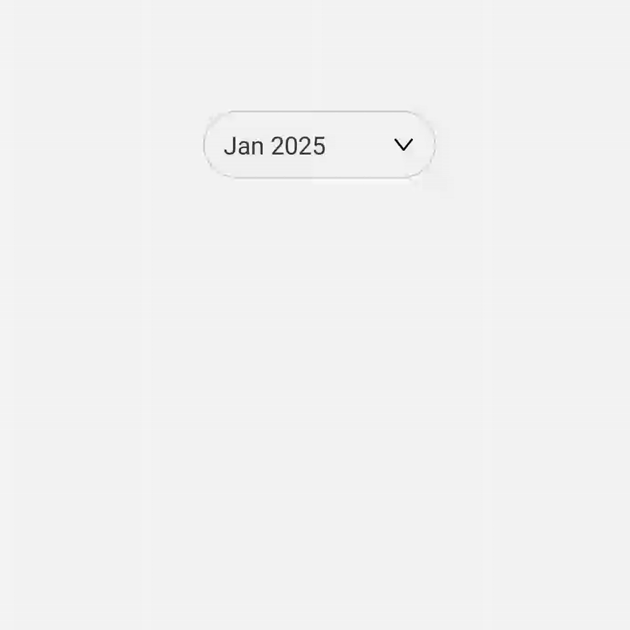

# rn-month-year-dropdown-picker

<div align="center">
<h2 align="center">📽️ Demo</h2>
<p align="center">
  
</p>
</div>

A simple and customizable month and year dropdown picker for React Native.

## ✨ Features

- Select Month and Year easily
- Fully customizable
- Supports both Android & iOS

---

## 📦 Installation

```bash
npm install rn-month-year-dropdown-picker
# or
yarn add rn-month-year-dropdown-picker
```
